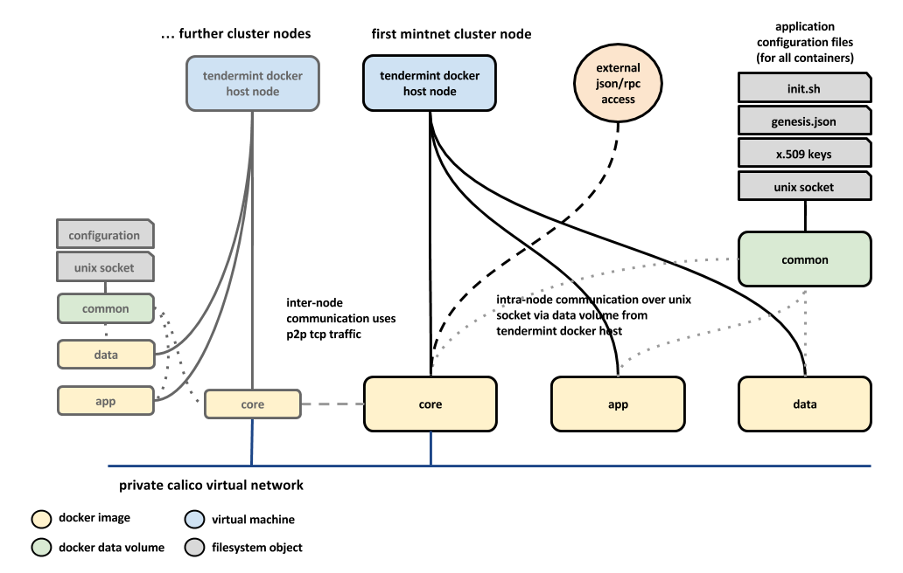

# Brooklyn Tendermint

Brooklyn blueprints for Tendermint application deployment.

This will contain the `.bom` files with Brooklyn catalog entries for the
Tendermint machines, and `.yaml` blueprints for deploying an application using
those machines.

## Tendermint Brooklyn Architecture

This diagram shows the components deployed by Brooklyn for a Tendermint MintNet
cluster, using the [`tendermint.bom`](tendermint-mintnet.bom) catalog entry.

----

Licensed under the Apache License, Version 2.0 (the "License");
you may not use this file except in compliance with the License.
You may obtain a copy of the License at

<http://www.apache.org/licenses/LICENSE-2.0>

Unless required by applicable law or agreed to in writing, software
distributed under the License is distributed on an "AS IS" BASIS,
WITHOUT WARRANTIES OR CONDITIONS OF ANY KIND, either express or implied.
See the License for the specific language governing permissions and
limitations under the License.
